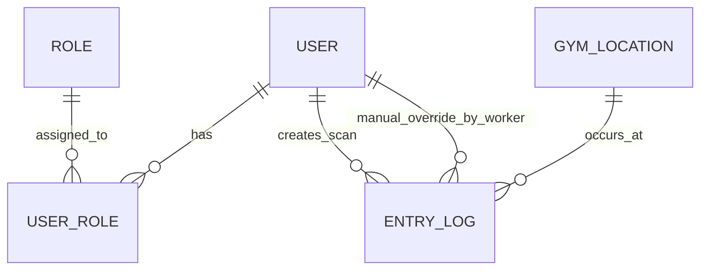
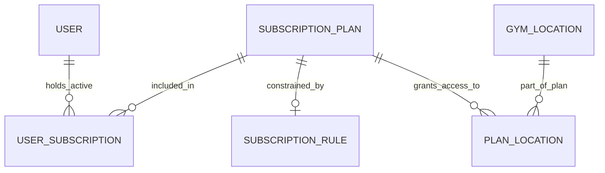
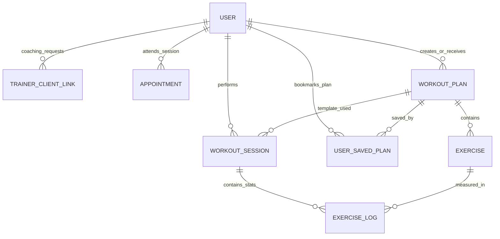

# Database Schemas & Architecture

This document outlines the database architecture for the FitPass Clone backend. The database is fully relational (PostgreSQL) and heavily utilizes foreign keys, cascading deletes, and many-to-many relationships. 

To maintain readability, the architecture is broken down into three core logical modules.

---

## 1. Identity & Gym Access Module
Handles user authentication, system roles (RBAC), and logging physical door entries.

**Key Tables:**
- **`users`**: Core authentication (email, hashed password).
- **`roles` & `user_roles`**: System-level permissions (`admin`, `worker`, `trainer`, `member`).
- **`entry_logs`**: The core auditing table for anti-fraud. Logs every QR scan, the specific `location_id`, and tracks manual door overrides via the `worker_id`.

---

## 2. Subscriptions & Billing Module
Manages subscription plans, strict access rules, and maps which plans are allowed at which physical gym branches.

**Key Tables:**
- **`subscription_plans`**: The base products (pricing and duration).
- **`subscription_rules`**: A One-to-One extension dictating strict access limits (e.g., restricted hours or specific days).
- **`plan_locations`**: Maps plans to physical `gym_locations`.
- **`user_subscriptions`**: Tracks active and expired subscriptions, populated automatically via Stripe Webhooks.

---

## 3. Coaching & Workout Tracking Module
Handles the social/training aspect of the gym: 1-on-1 coaching, custom workout plans, and daily progress tracking.

**Key Tables:**
- **`trainer_client_links`**: State machine (`PENDING`, `ACCEPTED`, `REJECTED`) for coaching requests.
- **`workout_plans` & `exercises`**: Workout templates. Plans with a null `client_id` are public, while assigned plans are private.
- **`workout_sessions` & `exercise_logs`**: Progress tracking. Records the exact date of a gym visit, alongside the actual weight lifted and reps completed for each exercise.