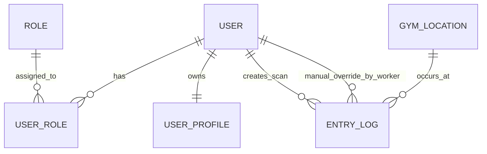
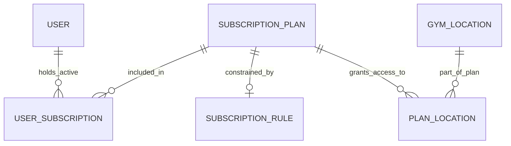
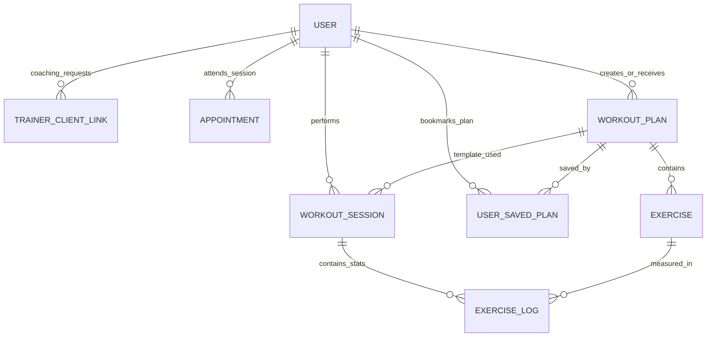

# Database Architecture & Schemas (v4.1)
 
This document outlines the relational database architecture for the FitPass Clone backend. The system leverages PostgreSQL, utilizing heavily normalized tables, foreign key constraints with cascading deletions, and performance-tuned B-Tree indexing for highly concurrent read/write operations.
 
To maintain structural clarity, the architecture is divided into three logical domains: Identity & Access, Billing, and Performance Tracking.
 
## Table of Contents
 
- [Notation](#notation)
- [1. Identity, Profiles & Gym Access](#1-identity-profiles--gym-access)
- [2. Subscriptions & Billing Module](#2-subscriptions--billing-module)
- [3. Coaching & Workout Tracking Module](#3-coaching--workout-tracking-module)
---
 
## Notation
 
The diagrams below follow standard Chen/crow's-foot ER notation as rendered by Mermaid:
 
| Symbol | Meaning |
|---|---|
| `\|\|--\|\|` | One-to-one |
| `\|\|--o{` | One-to-many |
| `}o--o{` | Many-to-many |
 
---
 
## 1. Identity, Profiles & Gym Access
 
This module forms the security perimeter of the application. It handles authentication, Role-Based Access Control (RBAC), user personalization, and the immutable logging of physical gym entries.
 

```mermaid
erDiagram
    USER ||--o{ USER_ROLE : has
    ROLE ||--o{ USER_ROLE : assigned_to
    USER ||--|| USER_PROFILE : owns
 
    USER ||--o{ ENTRY_LOG : creates_scan
    GYM_LOCATION ||--o{ ENTRY_LOG : occurs_at
    USER ||--o{ ENTRY_LOG : manual_override_by_worker
```
 
### Key Tables & Entities
 
| Table | Description |
|---|---|
| `users` | The core authentication entity. Stores `email`, Bcrypt `password_hash`, and boolean states (`is_active`, `is_verified`). |
| `user_profiles` | A strict one-to-one extension of the `users` table. Offloads heavy text data (`bio`, `fitness_goals`) and the processed `profile_picture_url` path to prevent unoptimized queries during authentication checks. |
| `roles` / `user_roles` | Implements RBAC through a many-to-many junction. Standard roles include `admin`, `worker`, `trainer`, and `member`. |
| `entry_logs` | The immutable auditing ledger. Records every turnstile scan with references to the `user_id` and the specific `location_id`. Tracks unauthorized bypasses, captures manual door overrides (`worker_id`), and strictly enforces state transitions via the `action_type` flag (`ENTRY` or `EXIT`). |
 
---
 
## 2. Subscriptions & Billing Module
 
This module manages the financial state, subscription tiers, Stripe webhook reconciliation, and physical location access constraints.
 

```mermaid
erDiagram
    USER ||--o{ USER_SUBSCRIPTION : holds_active
    SUBSCRIPTION_PLAN ||--o{ USER_SUBSCRIPTION : included_in
 
    SUBSCRIPTION_PLAN ||--o| SUBSCRIPTION_RULE : constrained_by
    SUBSCRIPTION_PLAN ||--o{ PLAN_LOCATION : grants_access_to
    GYM_LOCATION ||--o{ PLAN_LOCATION : part_of_plan
```
 
### Key Tables & Entities
 
| Table | Description |
|---|---|
| `subscription_plans` | Defines the base commercial offerings (pricing, duration). Utilizes an `is_active` boolean for soft deletions to preserve historical referential integrity. |
| `subscription_rules` | A one-to-one extension of a plan that dictates programmatic access limits, such as restricted temporal windows (e.g., `09:00` to `15:00`) or designated allowed days. |
| `gym_locations` | Physical real estate entities defining gym branches (name, address, 24/7 availability). |
| `plan_locations` | A many-to-many junction mapping specific subscription plans to allowed physical gym locations. |
| `user_subscriptions` | The active ledger of user memberships. Features compound B-Tree indexing on `is_active`, `plan_id`, and `user_id`. Critically maps to Stripe via `stripe_subscription_id` to guarantee idempotent processing of recurring billing webhook events. |
 
---
 
## 3. Coaching & Workout Tracking Module
 
This module drives the social and performance ecosystem. It maps trainer-client relationships, schedules private sessions, and acts as a telemetry engine for workout progression.
 

```mermaid
erDiagram
    USER ||--o{ TRAINER_CLIENT_LINK : coaching_requests
    USER ||--o{ APPOINTMENT : attends_session
    USER ||--o{ WORKOUT_PLAN : creates_or_receives
    WORKOUT_PLAN ||--o{ EXERCISE : contains
    USER ||--o{ USER_SAVED_PLAN : bookmarks_plan
    WORKOUT_PLAN ||--o{ USER_SAVED_PLAN : saved_by
    USER ||--o{ WORKOUT_SESSION : performs
    WORKOUT_PLAN ||--o{ WORKOUT_SESSION : template_used
    WORKOUT_SESSION ||--o{ EXERCISE_LOG : contains_stats
    EXERCISE ||--o{ EXERCISE_LOG : measured_in
```
 
### Key Tables & Entities
 
| Table | Description |
|---|---|
| `trainer_client_links` | Operates as a state machine tracking the lifecycle of a coaching relationship (`PENDING`, `ACCEPTED`, `REJECTED`). |
| `appointments` | Manages the scheduling of 1-on-1 private sessions between linked trainers and clients, including post-session trainer feedback nodes. |
| `workout_plans` | Blueprint templates composed by trainers. Plans possessing a `NULL` `client_id` operate as public marketplace templates, while explicitly assigned plans represent secure, private routines. |
| `exercises` | Granular instructions mapping to a plan (sets, reps, rest limits). Integrates a `requires_weight` boolean flag to differentiate hypertrophy exercises from bodyweight movements for accurate frontend analytical charting. |
| `workout_sessions` / `exercise_logs` | The telemetry engine. Captures exact timestamps of executed sessions, mapping actual user performance (`weight_kg`, completed reps) against the targeted template instructions. |