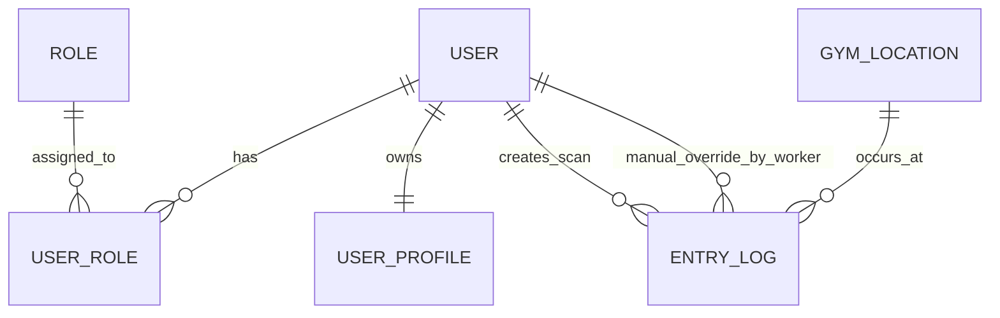
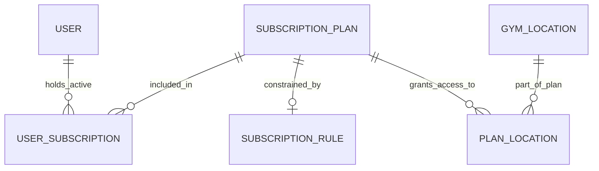
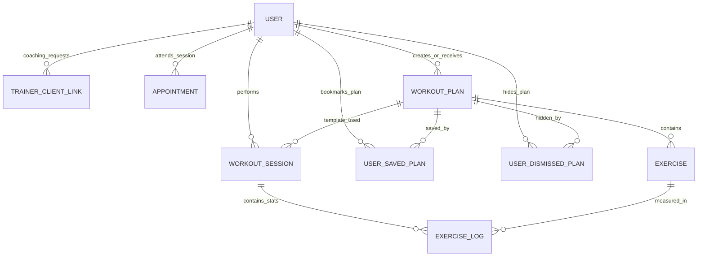

# Database Architecture & Schemas (v4.2)
 
This document outlines the relational database architecture for the FitPass Clone backend. The system leverages PostgreSQL, utilizing heavily normalized tables, foreign key constraints with cascading deletions, and performance-tuned B-Tree indexing for highly concurrent read/write operations.
 
The schema spans 18 tables. To maintain structural clarity, the architecture is divided into three logical domains: Identity & Access, Billing, and Performance Tracking. A fourth section documents the conventions that every table obeys.
 
## Table of Contents
 
- [Notation](#notation)
- [1. Identity, Profiles & Gym Access](#1-identity-profiles--gym-access)
- [2. Subscriptions & Billing Module](#2-subscriptions--billing-module)
- [3. Coaching & Workout Tracking Module](#3-coaching--workout-tracking-module)
- [4. Data Integrity Conventions](#4-data-integrity-conventions)
---
 
## Notation
 
The diagrams below follow standard Chen/crow's-foot ER notation as rendered by Mermaid:
 
| Symbol | Meaning |
|---|---|
| `\|\|--\|\|` | One-to-one |
| `\|\|--o{` | One-to-many |
| `}o--o{` | Many-to-many |
 
---
 
## 1. Identity, Profiles & Gym Access
 
This module forms the security perimeter of the application. It handles authentication, Role-Based Access Control (RBAC), user personalization, and the immutable logging of physical gym entries.
 

```mermaid
erDiagram
    USER ||--o{ USER_ROLE : has
    ROLE ||--o{ USER_ROLE : assigned_to
    USER ||--|| USER_PROFILE : owns
 
    USER ||--o{ ENTRY_LOG : creates_scan
    GYM_LOCATION ||--o{ ENTRY_LOG : occurs_at
    USER ||--o{ ENTRY_LOG : manual_override_by_worker
```
 
### Key Tables & Entities
 
| Table | Description |
|---|---|
| `users` | The core authentication entity. Stores `email`, Bcrypt `password_hash`, and boolean states (`is_active`, `is_verified`). Both `first_name` and `last_name` are nullable, so display names are never concatenated inline - every router formats them through `full_name()` in `app/api/helpers.py`, which is what keeps the literal string "None None" out of the admin panels. |
| `user_profiles` | A strict one-to-one extension of the `users` table. Offloads heavy text data (`bio`, `fitness_goals`) and the processed `profile_picture_url` path to prevent unoptimized queries during authentication checks. |
| `roles` / `user_roles` | Implements RBAC through a many-to-many junction. Standard roles include `admin`, `worker`, `trainer`, and `member`. A single user may hold several simultaneously, so membership lookups use an `EXISTS` subquery rather than a join, which would otherwise fan the row out once per matching role. |
| `entry_logs` | The immutable auditing ledger. Records every turnstile scan with references to the `user_id` and the specific `location_id`. Tracks unauthorized bypasses, captures manual door overrides (`worker_id`), and strictly enforces state transitions via the `action_type` flag (`ENTRY` or `EXIT`). Presence is derived from a member's most recent GRANTED log, with `id` breaking ties on identical timestamps; the Redis presence key mirrors that value and is rebuilt from this table whenever it is missing. |
 
---
 
## 2. Subscriptions & Billing Module
 
This module manages the financial state, subscription tiers, Stripe webhook reconciliation, and physical location access constraints.
 

```mermaid
erDiagram
    USER ||--o{ USER_SUBSCRIPTION : holds_active
    SUBSCRIPTION_PLAN ||--o{ USER_SUBSCRIPTION : included_in
 
    SUBSCRIPTION_PLAN ||--o| SUBSCRIPTION_RULE : constrained_by
    SUBSCRIPTION_PLAN ||--o{ PLAN_LOCATION : grants_access_to
    GYM_LOCATION ||--o{ PLAN_LOCATION : part_of_plan
```
 
### Key Tables & Entities
 
| Table | Description |
|---|---|
| `subscription_plans` | Defines the base commercial offerings (pricing, duration). Carries a `tier` label ("Standard", "Pro", "VIP") that drives pricing-card styling, and five perk booleans that decide what the membership actually includes: `includes_trainer`, `includes_group_classes`, `has_sauna_access`, `has_towel_service` and `allows_guest`. Only `includes_trainer` is enforced programmatically (in `app/api/coaching.py`); the remaining four are advertised on the pricing card and settled at the front desk by a person. Utilizes an `is_active` boolean for soft deletions to preserve historical referential integrity. |
| `subscription_rules` | A one-to-one extension of a plan that dictates programmatic access limits, such as restricted temporal windows (e.g., `09:00` to `15:00`) or designated allowed days. Evaluated against gym-local time, never against the raw UTC timestamp. |
| `gym_locations` | Physical real estate entities defining gym branches (name, address, 24/7 availability). |
| `plan_locations` | A many-to-many junction mapping specific subscription plans to allowed physical gym locations. A plan with no rows here grants access everywhere. |
| `user_subscriptions` | The active ledger of user memberships. Indexed individually on `user_id`, `plan_id` and `is_active`, the three columns every access check filters on, plus `stripe_subscription_id`. That last column maps the row back to Stripe, which is what guarantees idempotent processing of recurring billing webhooks; it is nullable for legacy one-time payments and desk-activated passes. |
 
> The perk booleans are columns on `subscription_plans`, not a separate entity, so they intentionally do not appear as a node in the diagram above. All six of them (`tier` included) carry a `server_default` as well as a Python default, so the ALTER TABLE backfilled every existing row. `is_active` predates that rule and was added nullable, which is why `PlanResponse` still needs a validator to tolerate NULL there.
 
---
 
## 3. Coaching & Workout Tracking Module
 
This module drives the social and performance ecosystem. It maps trainer-client relationships, schedules private sessions, and acts as a telemetry engine for workout progression.
 

```mermaid
erDiagram
    USER ||--o{ TRAINER_CLIENT_LINK : coaching_requests
    USER ||--o{ APPOINTMENT : attends_session
    USER ||--o{ WORKOUT_PLAN : creates_or_receives
    WORKOUT_PLAN ||--o{ EXERCISE : contains
    USER ||--o{ USER_SAVED_PLAN : bookmarks_plan
    WORKOUT_PLAN ||--o{ USER_SAVED_PLAN : saved_by
    USER ||--o{ USER_DISMISSED_PLAN : hides_plan
    WORKOUT_PLAN ||--o{ USER_DISMISSED_PLAN : hidden_by
    USER ||--o{ WORKOUT_SESSION : performs
    WORKOUT_PLAN ||--o{ WORKOUT_SESSION : template_used
    WORKOUT_SESSION ||--o{ EXERCISE_LOG : contains_stats
    EXERCISE ||--o{ EXERCISE_LOG : measured_in
```
 
### Key Tables & Entities
 
| Table | Description |
|---|---|
| `trainer_client_links` | Operates as a state machine tracking the lifecycle of a coaching relationship (`PENDING`, `ACCEPTED`, `REJECTED`). Creating a link requires an active subscription carrying the `includes_trainer` perk, and so does booking against it. |
| `appointments` | Manages the scheduling of 1-on-1 private sessions between linked trainers and clients, including post-session trainer feedback nodes. Moves through `SCHEDULED`, `COMPLETED` and `CANCELLED`. The temporal rules - a 60 day booking horizon, and no completion before `start_time` has passed - are enforced in the API layer rather than by a database constraint, because both depend on the current clock. |
| `workout_plans` | Blueprint templates composed by trainers. Plans possessing a `NULL` `client_id` operate as public marketplace templates, while explicitly assigned plans represent secure, private routines. |
| `user_saved_plans` | A many-to-many junction recording which public plans a member follows. Following is reversible: removing the row detaches the plan from that member only and never touches the trainer's original. |
| `user_dismissed_plans` | The counterpart for ASSIGNED plans, which a member cannot simply unfollow because they did not choose them. A dismissal hides a finished plan from the member's library without modifying or deleting it, so the trainer keeps their copy and the member can restore it at any time. Rows here are filtered out of the private-plans listing, which is where the hiding actually takes effect. |
| `exercises` | Granular instructions mapping to a plan (sets, reps, rest limits). Integrates a `requires_weight` boolean flag to differentiate hypertrophy exercises from bodyweight movements for accurate frontend analytical charting. Three columns carry the trainer's setup into the client app: `recommended_weight_kg` pre-fills the target, `weight_step_kg` defines how much one press of the "+" button adds (2.5 kg on free weights, 4.5 or 6.8 kg on cable stacks, 2.25 kg on drop-pins), and `instructions` holds the form cues shown above the exercise card. |
| `workout_sessions` | The header of one visit to the gym: who trained, which plan they followed, when, and any free-text note. A session survives the deletion of its template (`plan_id` is `SET NULL`), so history is never lost when a trainer retires a plan. |
| `exercise_logs` | The telemetry engine, storing ONE ROW PER SET rather than one aggregated row per exercise. A 3 set bench press produces 3 rows, numbered from 1 through `set_number`, which is what lets the history screen render a real breakdown ("60kg x 10, 60kg x 8, 55kg x 8") instead of a single averaged number. A personal record is therefore the maximum `weight_kg` across all rows of one exercise inside one session. Because every read groups by `(session_id, exercise_id)` and this model writes roughly three times as many rows as the old one, that pair carries its own compound index, `ix_exercise_logs_session_exercise`. |
 
---
 
## 4. Data Integrity Conventions
 
These rules hold across every table above. They are decisions rather than column definitions, so they are not visible in the diagrams - but breaking one of them is how the same query starts returning different answers in test and in production.
 
| Convention | Rationale |
|---|---|
| Every timestamp is `DateTime(timezone=True)` and stored in **UTC** | Anything an admin reads as a time of day (peak hours, "today", weekly grouping) is converted through `to_gym_time()` first, using `GYM_TIMEZONE`. Reading `.hour` or `.date()` straight off a stored value charts an 18:00 local rush hour at 16:00. |
| A day boundary is a **half-open UTC range**, never `func.date(col)` | The date extraction happens inside the database, in UTC, where no Python conversion can reach it. Filtering on a range derived from the local day also leaves the column bare, so its index still applies. |
| Retired rows are **soft deleted** via `is_active` | Plans and users are referenced by historical subscriptions and entry logs. Hiding a row from the frontend preserves referential integrity; deleting it would orphan the audit trail. |
| Parent-child links declare `cascade="all, delete-orphan"` on the **ORM relationship**, alongside `ON DELETE CASCADE` on the foreign key | SQLAlchemy de-associates children before the database is ever asked, emitting `UPDATE ... SET user_id = NULL` against a NOT NULL column. The database-level cascade never gets a chance. Deleting through the ORM also keeps SQLite and PostgreSQL behaving identically, since SQLite does not enforce foreign keys unless the PRAGMA is on. |
| Every added NOT NULL column carries **both** `server_default` and a Python `default` | `server_default` is what backfills the existing rows during the ALTER TABLE; the Python `default` covers ORM inserts, which never touch the server default. Supplying only one of the two produces either a failed migration or silent NULLs. |
| Paginated queries always sort on a column **plus `id`** | Timestamps genuinely tie, and paging an unstable sort repeats a row on one page while dropping it from the next. SQLite usually hides this by returning insertion order, so a passing test is not proof - it surfaces on PostgreSQL. |
| List endpoints return `{ "total": n, "items": [...] }` | `total` counts the whole filtered set rather than the page, which is what lets a client know whether a Next button should be enabled at all. |
| **Alembic owns the schema** | The application lifespan runs neither `create_all` nor any migration. Development applies them with `alembic upgrade head`; the production stack runs the same command in a dedicated one-shot container before the API is allowed to start. |